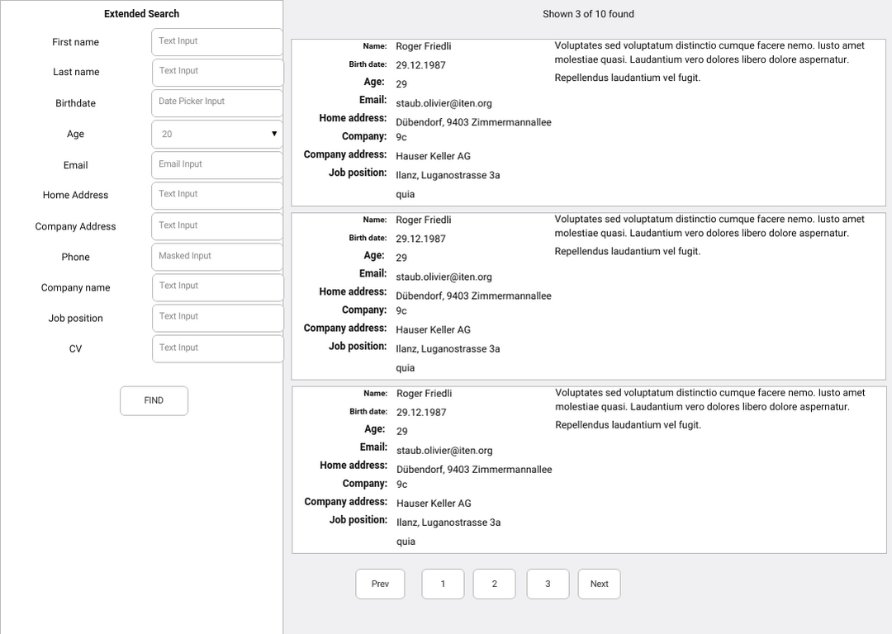

# M&P Test Task for PHP/Python-Fullstack Engineer 

## Motivation

This task should help us see how you work. It should check the following skills

* Backend _and_ frontend development
* Basic design skills
* Ability to manage time

## Time limit

The time is limited to *4 hours* so you should carefully prioritize.  

### As an admin I want to import a set of users from CSV file into database using a command line interface

Symfony:

    $ ./bin/console users:import -f /path/to/file.csv
    
Django: 

    $ ./manage.py users-import -f /path/to/file.csv 

The import process must succeed (and import all valid users) from the first time.  

###  As an admin I want to import a set of users using graphical user interface
  
* Place an "Upload" button somewhere on the page;  
* On click on that page I am asked to choose a csv file with I want to use as users source (same as for CLI app).  

### As an admin I want to be able to search for users using any combination of the criteria

   * first name
   * last name
   

(The mockup already includes the bonus tasks from below.)

### Bonus tasks 

These tasks can be done if you have time left.

* It should show 10 rows per page and implement a pagination
* It should be possible to search for the following criterias
   - birthday
   - age
   - email
   - home address (city, zip, street) - (the order of the search terms should be choosable by the user. E.g. _"1234 Minsk"_, or _"Minsk 1234"_) 
   - phone
   - company name
   - company address (city, street) - (as above, the order of the search term should be flexible)
   - job position
   - CV

## Tech requirements

   1. the app should be based on Symfony, Zend Framework 1 or Django (depending on the job you apply for)
   2. Twitter Bootstrap should be used as UI framework
   3. the search should work without page reload (ajax or similar technology)
   4. any JS library/framework is allowed
   5. layout should be like on the mockup
   6. For PHP: cli, fpm, apache PHP envs must set `memory_limit = 128M` and `max_execution_time = 30`.
